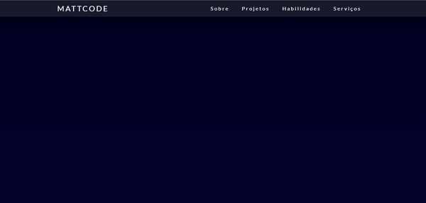

# Meu Portfolio

### Sobre o projeto
Meu portfólio onde apliquei alguns conhecimentos que eu possuo 
• HTML semântico para um bom SEO do site ajudando a indexar o site  em mecanismo de busca como google
• SASS para otimizar o CSS, uso de  MEDIA QUERIES para melhor experiência em qualquer dispositivo
• JAVASCRIPT para aplicar bibliotecas e eventos de mouse para uma melhor interatividade com o usuário 

## Tecnologias utilizadas
- HTML
- CSS/SASS
- JAVASCRIPT

## VERSÃO WEB

## VERSÃO MOBILE

## Link
**live preview**: https://matheusoliveira047.github.io/Meu_Portfolio/

## Obs
caso queira analisar o codigo como se estivesse no vscode aperte a tecla ponto (.)
